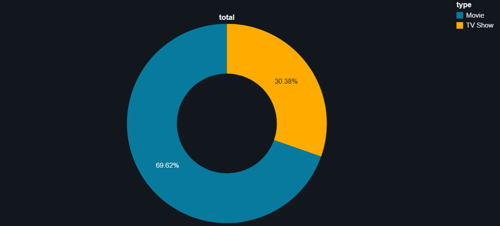
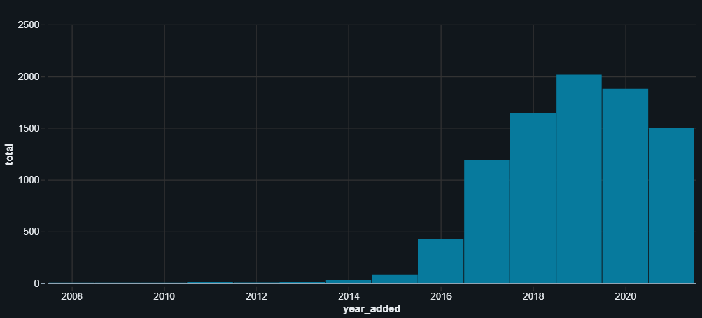
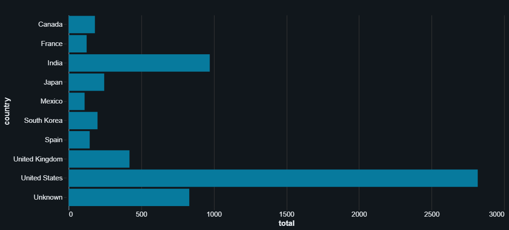
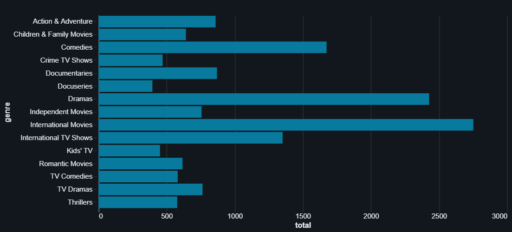
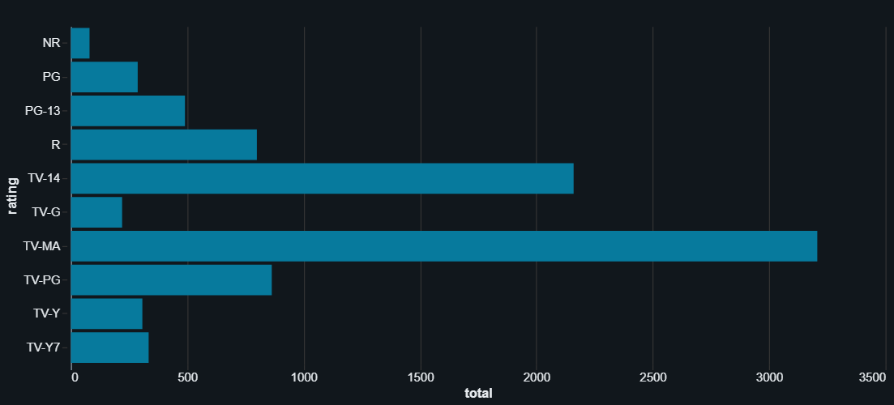

# 🎬 Netflix ETL with Databricks  

## 📌 Overview  
- This project demonstrates an end-to-end ETL (Extract, Transform, Load) pipeline using Databricks and PySpark.  
- We work with the Netflix dataset to showcase how data is ingested, cleaned, transformed, and prepared for analytics using the **Bronze-Silver-Gold (Medallion) architecture** in Databricks.  

---

## ⚙️ ETL Process  

### 🔹 Bronze Layer (Raw Data)  
- Ingested the raw CSV file into Databricks using PySpark.  
- Added metadata such as:  
  - `ingest_ts` → ingestion timestamp  
  - `source_file` → source file name  

### 🔸 Silver Layer (Cleaned Data)  
- Cleaned and transformed the data:  
  - Removed duplicates  
  - Standardized date formats  
  - Handled missing values  
- Derived useful fields:  
  - `duration_mins` (movie duration in minutes)  
  - `genres` (split from listed_in)  
  - `content_age` (age since release year)  
- Stored as **Delta Tables** for reliability and ACID compliance.  

### 🟡 Gold Layer (Curated Data)  
- Aggregated and analytics-ready tables.  
- Examples:  
  - Count of shows by country  
  - Distribution by release year  
  - Breakdown by content type (Movies vs TV Shows)  

---

## 🛠️ Technologies Used  
- Databricks (Free Community Edition)  
- Apache Spark / PySpark  
- Delta Lake  
- SQL (Databricks SQL for queries & analysis)  

---

## 📊 Visualizations & Insights  

### 1. 🎬 Movies vs TV Shows  
  
- Movies dominate Netflix’s catalog (~70%), while TV Shows are ~30%.  
- This shows Netflix prioritizes films, but TV content is also significant.  

### 2. 📈 Yearly Trend of Releases  
  
- Rapid growth after 2015, peaking in 2018–2019.  
- Matches Netflix’s global expansion timeline.  

### 3. 🌍 Top 10 Countries by Titles  
  
- US leads with the largest catalog, followed by India and the UK.  
- India is Netflix’s second-largest market after the US.  

### 4. 🎭 Top 15 Genres  
  
- *International Movies*, *Dramas*, and *Comedies* dominate.  
- Shows Netflix balances both entertainment and informative content.  

### 5. 🔢 Most Common Ratings  
  
- TV-MA and TV-14 dominate, showing focus on mature and teen audiences.  
- Kids/family content exists but is much smaller.  

### 6. ⏱ Movie Duration Distribution  
  
- Most Netflix movies are between **90–120 minutes**.  
- This aligns with standard global movie runtimes.  

---

## 🚀 Key Takeaways  
- Built a complete **ETL pipeline** using PySpark and Delta Lake.  
- Learned how to apply the **Medallion Architecture (Bronze → Silver → Gold)**.  
- Generated **business insights** from raw data using SQL & visualizations.  
- Strengthened data storytelling and analytical presentation skills.  

---
